# Design Styles Catalogue — 50 Styles for Prompting & Content

Source: *50 Design Styles Every Designer Should Know for Better Prompting* (Himanshu Bhardwaj, UX Planet). Descriptions, core elements, and mood are from the article. Reference images are saved locally under `references/images/`. **Prompt scaffold** and **starter tokens** are added for AI-generation and frontend workflows — tokens are starting points to ADAPT, not fixed rules.

> How to use: name the style up front in any AI prompt, mix two for a hybrid (e.g. *Vaporwave x Gothic*), or lift the tokens into a carousel/frontend build. See `SKILL.md` for the full method.

---

## 1. Neoclassical

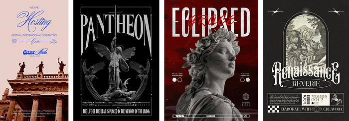

Neoclassical design is rooted in the grandeur of classical antiquity. It revives Greco-Roman ideals like order, symmetry, and refined elegance. Often used in architecture and interiors, it’s now echoed in UI and brand design to communicate tradition and authority.

- **Core elements:** Serif fonts, columns, laurel wreaths, marble textures, gold accents, symmetry, muted palettes.
- **Mood & occasion:** Formal, timeless, noble. Ideal for luxury brands, museums, heritage products, or academic publications.
- **Type:** High-contrast serif (Didone/Trajan), centred
- **Layout & motion:** Symmetry, columns, generous margins, restrained motion
- **Starter tokens:** `--bg:#F5F1E8 --surface:#FFFFFF --ink:#2B2B2B --accent:#B8924A(gold) --muted:#7A7468`
- **Prompt scaffold:** "[your subject / scene], in the **Neoclassical** style. serif fonts, columns, laurel wreaths, marble textures, gold accents, symmetry, muted palettes. Mood: formal, timeless, noble. ideal for luxury brands, museums, heritage products, or academic publications. [add: composition, lighting, medium, aspect ratio]."

---

## 2. Baroque

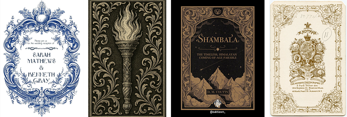

Baroque design is opulent, emotional, and dramatic. Emerging from 17th-century Europe, it thrives on excess — ornamentation, grandeur, and a theatrical sense of movement. In digital design, it shows up in highly decorative interfaces or dramatic visuals meant to awe.

- **Core elements:** Flourishes, deep shadows, gold leaf, religious or mythological motifs, rich textiles, high contrast.
- **Mood & occasion:** Regal, ornate, celebratory. Works well for event invitations, premium packaging, or lavish editorial designs.
- **Type:** Ornate serif, swashes
- **Layout & motion:** Dense flourishes, gold-on-dark, dramatic reveals
- **Starter tokens:** `--bg:#1A1410 --gold:#C9A227 --accent:#7B1E1E(crimson) --cream:#EDE4D3 --ink:#2A2018`
- **Prompt scaffold:** "[your subject / scene], in the **Baroque** style. flourishes, deep shadows, gold leaf, religious or mythological motifs, rich textiles, high contrast. Mood: regal, ornate, celebratory. works well for event invitations, premium packaging, or lavish editorial designs. [add: composition, lighting, medium, aspect ratio]."

---

## 3. Aurora

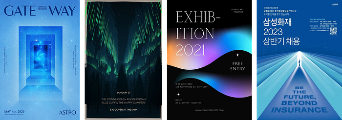

Inspired by the northern lights, Aurora style features flowing, iridescent gradients and dreamy abstractions. It’s futuristic yet soft, often used in ambient digital designs or cosmic brand visuals. It reflects a sense of wonder and fluid motion.

- **Core elements:** Iridescent gradients, blur effects, soft glows, translucent overlays, organic wave forms.
- **Mood & occasion:** Dreamy, futuristic, meditative. Suitable for wellness apps, tech product launches, or spiritual themes.
- **Type:** Soft geometric sans
- **Layout & motion:** Gradient meshes, glow, slow drifting blur
- **Starter tokens:** `--bg:#0B1026 --teal:#5EEAD4 --violet:#A78BFA --pink:#F472B6 --text:#E6E8F2`
- **Prompt scaffold:** "[your subject / scene], in the **Aurora** style. iridescent gradients, blur effects, soft glows, translucent overlays, organic wave forms. Mood: dreamy, futuristic, meditative. suitable for wellness apps, tech product launches, or spiritual themes. [add: composition, lighting, medium, aspect ratio]."

---

## 4. Ethereal

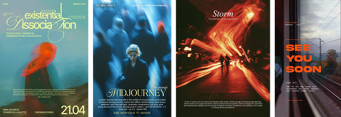

Ethereal design captures delicacy and transcendence. It feels weightless and otherworldly — like a design made of mist or light. This style emphasizes openness, airiness, and subtle beauty, often with soft pastels and faint textures.

- **Core elements:** Light pastels, gauzy overlays, minimal serif fonts, low contrast, feathered shadows.
- **Mood & occasion:** Calm, mystical, romantic. Works beautifully for spiritual brands, high fashion, or mindfulness interfaces.
- **Type:** Light serif or airy sans
- **Layout & motion:** Soft blur, lots of negative space, gentle fades
- **Starter tokens:** `--bg:#F7F4FB --mist:#E9E4F0 --accent:#C4B5E0(lavender) --text:#4A4458`
- **Prompt scaffold:** "[your subject / scene], in the **Ethereal** style. light pastels, gauzy overlays, minimal serif fonts, low contrast, feathered shadows. Mood: calm, mystical, romantic. works beautifully for spiritual brands, high fashion, or mindfulness interfaces. [add: composition, lighting, medium, aspect ratio]."

---

## 5. Filigree

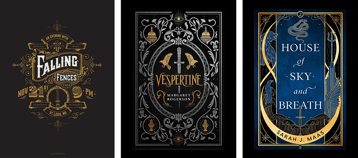

Filigree is a decorative art style characterized by intricate and delicate ornamentation — usually in gold or silver. In design, it translates to fine linework, lacy embellishments, and regal patterns that add an old-world luxury appeal.

- **Core elements:** Delicate line patterns, metallic inks, curves, lace textures, monogram fonts.
- **Mood & occasion:** Luxurious, vintage, ceremonial. Perfect for heritage branding, editorial layouts, or luxury packaging.
- **Type:** Fine serif
- **Layout & motion:** Thin decorative linework, delicate borders, subtle
- **Starter tokens:** `--bg:#FBF8F1 --gold:#B08D57 --ink:#2E2A24 --line:#D8C9A8`
- **Prompt scaffold:** "[your subject / scene], in the **Filigree** style. delicate line patterns, metallic inks, curves, lace textures, monogram fonts. Mood: luxurious, vintage, ceremonial. perfect for heritage branding, editorial layouts, or luxury packaging. [add: composition, lighting, medium, aspect ratio]."

---

## 6. Acanthus

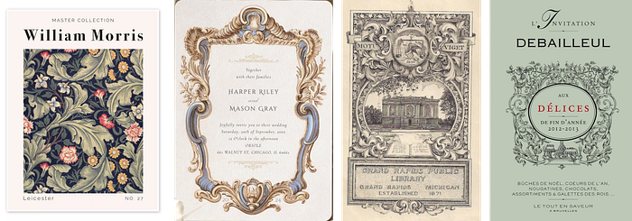

The Acanthus style is rooted in classical architectural ornamentation, inspired by the acanthus plant’s foliage. Commonly seen in Corinthian columns and decorative arts, it symbolizes endurance and elegance. In design, it’s used for adding a natural yet regal decorative flourish.

- **Core elements:** Leaf motifs, flowing curves, symmetrical vines, stone textures, natural greens and golds.
- **Mood & occasion:** Regal, organic, classical. Suitable for wedding invites, art museum branding, or premium product design.
- **Type:** Classical serif
- **Layout & motion:** Foliate scrolls, leaf motifs, carved feel
- **Starter tokens:** `--bg:#F2EFE6 --green:#4C5B3C --gold:#A98B4E --ink:#2A2A22`
- **Prompt scaffold:** "[your subject / scene], in the **Acanthus** style. leaf motifs, flowing curves, symmetrical vines, stone textures, natural greens and golds. Mood: regal, organic, classical. suitable for wedding invites, art museum branding, or premium product design. [add: composition, lighting, medium, aspect ratio]."

---

## 7. Anthropomorphic

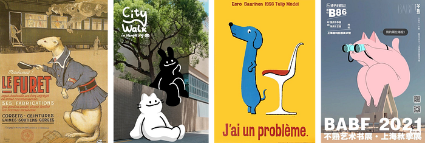

Anthropomorphic design gives human traits to non-human forms — objects, animals, or even UI elements. It adds playfulness and relatability, helping users emotionally connect with the design. Often used in mascots, illustrations, and storytelling interfaces.

- **Core elements:** Expressive eyes, limbs on objects, character-based icons, rounded friendly shapes.
- **Mood & occasion:** Fun, quirky, friendly. Great for children’s products, gamified UX, or approachable branding.
- **Type:** Rounded friendly sans
- **Layout & motion:** Objects with faces/expressions, springy bounce
- **Starter tokens:** `--bg:#FFF7EC --accent:#FF8A5B --accent2:#4ECDC4 --ink:#2D2A32`
- **Prompt scaffold:** "[your subject / scene], in the **Anthropomorphic** style. expressive eyes, limbs on objects, character-based icons, rounded friendly shapes. Mood: fun, quirky, friendly. great for children’s products, gamified ux, or approachable branding. [add: composition, lighting, medium, aspect ratio]."

---

## 8. Pixel Art

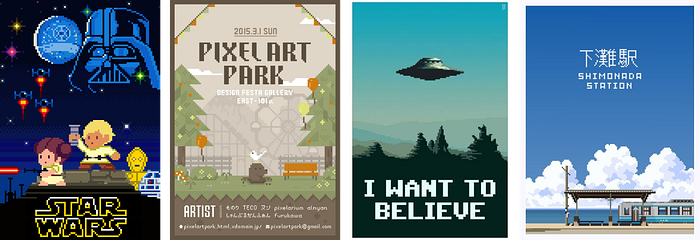

Pixel Art is a nostalgic style that harks back to early computer and video game graphics. Each image is built with visible pixels, creating a retro yet playful aesthetic. It’s highly stylized and instantly communicates a love for the analog digital era.

- **Core elements:** Grid-based visuals, low-res icons, limited color palettes, 8-bit/16-bit look.
- **Mood & occasion:** Nostalgic, geeky, fun. Ideal for indie games, retro-themed events, or creative portfolios.
- **Type:** Pixel/monospace font
- **Layout & motion:** Hard pixels, dithering, NO anti-alias, stepped motion
- **Starter tokens:** `--bg:#1E1E2E --pink:#FF5C8A --blue:#57C7FF --green:#7CFF6B --ink:#0C0C14`
- **Prompt scaffold:** "[your subject / scene], in the **Pixel Art** style. grid-based visuals, low-res icons, limited color palettes, 8-bit/16-bit look. Mood: nostalgic, geeky, fun. ideal for indie games, retro-themed events, or creative portfolios. [add: composition, lighting, medium, aspect ratio]."

---

## 9. Conceptual Sketch

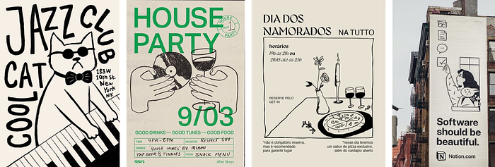

This style mimics rough hand-drawn sketches, often used in ideation or artistic branding. It emphasizes spontaneity and imagination over polish. It gives a behind-the-scenes, raw creative feel.

- **Core elements:** Pencil/ink lines, crosshatching, greyscale tones, annotations, sketch paper texture.
- **Mood & occasion:** Experimental, informal, idea-driven. Works well for portfolios, design journals, or brainstorming tools.
- **Type:** Hand-drawn/marker font
- **Layout & motion:** Loose lines, annotations, lo-fi wireframe energy
- **Starter tokens:** `--bg:#FBFBF8(paper) --ink:#222222 --accent:#2F6FED(blue) --pencil:#8A8A8A`
- **Prompt scaffold:** "[your subject / scene], in the **Conceptual Sketch** style. pencil/ink lines, crosshatching, greyscale tones, annotations, sketch paper texture. Mood: experimental, informal, idea-driven. works well for portfolios, design journals, or brainstorming tools. [add: composition, lighting, medium, aspect ratio]."

---

## 10. Luxury Typography

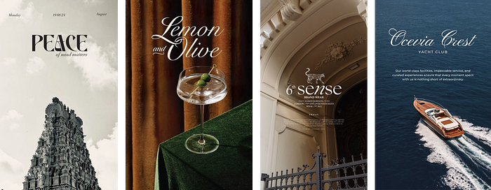

Luxury Typography relies on refined letterforms to exude elegance and class. It often pairs minimalist layout with expressive serif fonts or custom logotypes, allowing typography alone to carry the brand identity.

- **Core elements:** Serif fonts, high letter spacing, gold foil, monochrome palettes, bespoke ligatures.
- **Mood & occasion:** Elegant, elite, timeless. Best for luxury fashion, beauty brands, or high-end editorial design.
- **Type:** Oversized high-contrast serif
- **Layout & motion:** Type IS the design, huge scale, vast space, slow
- **Starter tokens:** `--bg:#0F0F0F --text:#F5F5F0 --accent:#C5A572(gold)`
- **Prompt scaffold:** "[your subject / scene], in the **Luxury Typography** style. serif fonts, high letter spacing, gold foil, monochrome palettes, bespoke ligatures. Mood: elegant, elite, timeless. best for luxury fashion, beauty brands, or high-end editorial design. [add: composition, lighting, medium, aspect ratio]."

---

## 11. Japandi

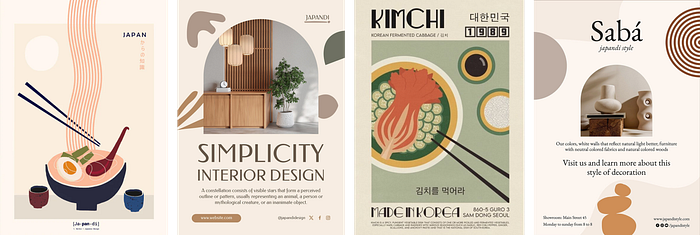

Japandi fuses Japanese minimalism with Scandinavian functionality. It focuses on simplicity, craftsmanship, and nature-inspired serenity. In UI, it translates into calm, decluttered interfaces with neutral tones and soft curves.

- **Core elements:** Light woods, beige/gray palettes, clean sans-serif fonts, minimal icons, natural materials.
- **Mood & occasion:** Calm, peaceful, intentional. Ideal for lifestyle brands, home decor, or meditation and wellness apps.
- **Type:** Light humanist sans or thin serif
- **Layout & motion:** Calm, spare, natural materials, minimal motion
- **Starter tokens:** `--bg:#EDE8E0 --wood:#B89B7A --ink:#3A3631 --sage:#6B7363`
- **Prompt scaffold:** "[your subject / scene], in the **Japandi** style. light woods, beige/gray palettes, clean sans-serif fonts, minimal icons, natural materials. Mood: calm, peaceful, intentional. ideal for lifestyle brands, home decor, or meditation and wellness apps. [add: composition, lighting, medium, aspect ratio]."

---

## 12. Memphis

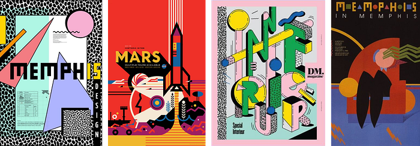

Memphis design is bold, loud, and unapologetically fun. Originating in the 1980s, it throws rules out the window with geometric shapes, high contrast colors, and abstract patterns. It’s playful, rebellious, and full of attitude.

- **Core elements:** Squiggles, bright primaries, grids, clashing colors, block shapes, cartoonish motifs.
- **Mood & occasion:** Youthful, quirky, anti-establishment. Great for creative brands, event posters, or retro fashion.
- **Type:** Bold geometric sans
- **Layout & motion:** Squiggles, confetti shapes, clashing playful blocks
- **Starter tokens:** `--bg:#FDF6E3 --red:#FF5252 --cyan:#00BCD4 --yellow:#FFD600 --ink:#111111`
- **Prompt scaffold:** "[your subject / scene], in the **Memphis** style. squiggles, bright primaries, grids, clashing colors, block shapes, cartoonish motifs. Mood: youthful, quirky, anti-establishment. great for creative brands, event posters, or retro fashion. [add: composition, lighting, medium, aspect ratio]."

---

## 13. Bohemian

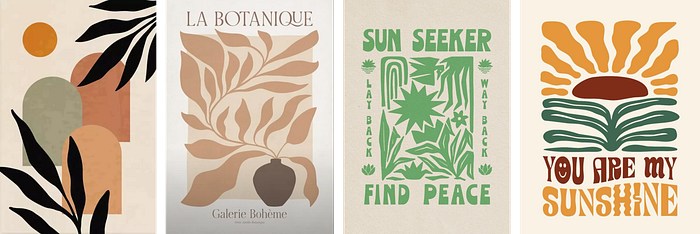

Bohemian design embraces artistic freedom and earthy charm. It’s eclectic, globally inspired, and layered with patterns, textiles, and natural elements. In digital spaces, it evokes free-spirited lifestyles and wanderlust.

- **Core elements:** Rich textures, mandalas, jewel tones, ethnic prints, script fonts, organic materials.
- **Mood & occasion:** Free, soulful, eclectic. Ideal for handmade products, travel brands, or artisanal markets.
- **Type:** Organic serif
- **Layout & motion:** Layered earthy patterns, warm, hand-crafted
- **Starter tokens:** `--bg:#F3E9DC --terracotta:#C06B47 --mustard:#D9A441 --green:#7A8450 --ink:#3B2F2A`
- **Prompt scaffold:** "[your subject / scene], in the **Bohemian** style. rich textures, mandalas, jewel tones, ethnic prints, script fonts, organic materials. Mood: free, soulful, eclectic. ideal for handmade products, travel brands, or artisanal markets. [add: composition, lighting, medium, aspect ratio]."

---

## 14. Shabby Chic

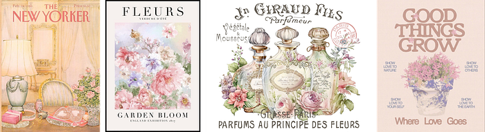

Shabby Chic combines vintage charm with feminine elegance. It often showcases distressed finishes, florals, and pastel tones. The aesthetic is lived-in yet curated, offering soft nostalgia.

- **Core elements:** Whitewashed textures, faded florals, cursive typography, lace, soft pinks and blues.
- **Mood & occasion:** Romantic, cozy, nostalgic. Common in weddings, vintage boutiques, and home decor.
- **Type:** Script + soft serif
- **Layout & motion:** Faded floral, distressed texture, gentle
- **Starter tokens:** `--bg:#F7F1EC --rose:#D9A7A0 --sage:#AEB99A --cream:#FBF7F2 --ink:#5A4F49`
- **Prompt scaffold:** "[your subject / scene], in the **Shabby Chic** style. whitewashed textures, faded florals, cursive typography, lace, soft pinks and blues. Mood: romantic, cozy, nostalgic. common in weddings, vintage boutiques, and home decor. [add: composition, lighting, medium, aspect ratio]."

---

## 15. Farmhouse / Cottagecore

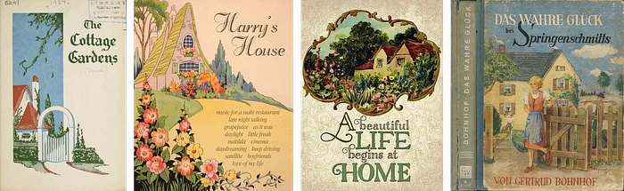

Cottagecore is a romanticization of rural life, rooted in simplicity, nature, and slow living. It often uses handmade textures and vintage rural motifs. Farmhouse adds a more rustic, American countryside twist.

- **Core elements:** Florals, gingham, wood textures, antique finishes, serif or hand-drawn type.
- **Mood & occasion:** Cozy, nostalgic, wholesome. Perfect for lifestyle blogs, recipe sites, or rustic home brands.
- **Type:** Serif + casual script
- **Layout & motion:** Rustic, homely, natural, cosy warmth
- **Starter tokens:** `--bg:#F4EFE6 --sage:#8A9A6B --cream:#FBF8F0 --wood:#9C7A56 --ink:#3E392F`
- **Prompt scaffold:** "[your subject / scene], in the **Farmhouse / Cottagecore** style. florals, gingham, wood textures, antique finishes, serif or hand-drawn type. Mood: cozy, nostalgic, wholesome. perfect for lifestyle blogs, recipe sites, or rustic home brands. [add: composition, lighting, medium, aspect ratio]."

---

## 16. Victorian

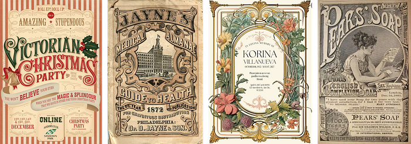

Victorian design is grand, elaborate, and deeply ornate, stemming from the aesthetics of the 19th-century British monarchy. It reflects wealth, refinement, and a love for detail — often used today for vintage or historical storytelling.

- **Core elements:** Ornate serif fonts, damask patterns, deep reds and greens, gilded frames, heavy florals.
- **Mood & occasion:** Opulent, historical, romantic. Ideal for book covers, tea brands, vintage fashion, or museum events.
- **Type:** Ornate serif
- **Layout & motion:** Dense ornament, decorative frames, formal
- **Starter tokens:** `--bg:#20140F --gold:#B08A3E --burgundy:#6E1F2A --cream:#E8DDCB`
- **Prompt scaffold:** "[your subject / scene], in the **Victorian** style. ornate serif fonts, damask patterns, deep reds and greens, gilded frames, heavy florals. Mood: opulent, historical, romantic. ideal for book covers, tea brands, vintage fashion, or museum events. [add: composition, lighting, medium, aspect ratio]."

---

## 17. Art Deco

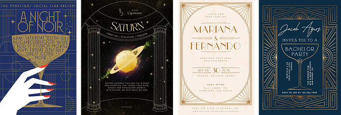

Art Deco is sleek, geometric, and sophisticated, born from the glamour of the 1920s. It combines streamlined modernism with luxurious materials and symmetrical patterns. It’s both nostalgic and aspirational.

- **Core elements:** Gold accents, sunbursts, symmetry, angular shapes, rich jewel tones, sans-serifs with flair.
- **Mood & occasion:** Glamorous, upscale, jazzy. Perfect for luxury brands, cocktail events, or retro-modern interfaces.
- **Type:** Geometric serif/sans, condensed caps
- **Layout & motion:** Symmetry, sunbursts, chevrons, metallic lines
- **Starter tokens:** `--bg:#11161D --gold:#C9A24B --teal:#1FA8A0 --cream:#EFE7D6`
- **Prompt scaffold:** "[your subject / scene], in the **Art Deco** style. gold accents, sunbursts, symmetry, angular shapes, rich jewel tones, sans-serifs with flair. Mood: glamorous, upscale, jazzy. perfect for luxury brands, cocktail events, or retro-modern interfaces. [add: composition, lighting, medium, aspect ratio]."

---

## 18. Art Nouveau

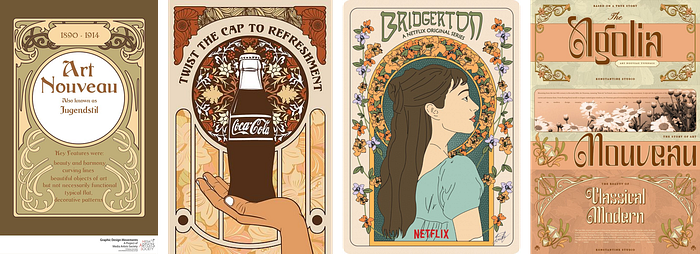

Art Nouveau is nature-inspired, fluid, and highly decorative. It celebrates organic forms — especially floral and botanical — and appears elegant and expressive. Common in poster design and decorative illustration.

- **Core elements:** Curving lines, floral motifs, hand-lettered type, earthy palettes, stained glass patterns.
- **Mood & occasion:** Romantic, poetic, organic. Best for artistic brands, natural cosmetics, or artisan packaging.
- **Type:** Flowing organic serif
- **Layout & motion:** Whiplash curves, florals, sinuous borders
- **Starter tokens:** `--bg:#EDE6D3 --green:#5C6B3C --gold:#A98742 --plum:#6B3F58 --ink:#2E2A22`
- **Prompt scaffold:** "[your subject / scene], in the **Art Nouveau** style. curving lines, floral motifs, hand-lettered type, earthy palettes, stained glass patterns. Mood: romantic, poetic, organic. best for artistic brands, natural cosmetics, or artisan packaging. [add: composition, lighting, medium, aspect ratio]."

---

## 19. Mystical Western

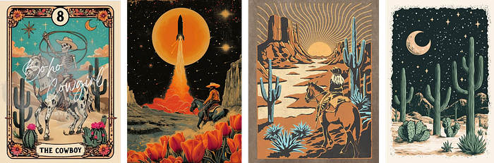

A fantasy fusion of cowboy westerns and occult mysticism, this style blends desert iconography with celestial symbols. It’s rugged yet spiritual — a trending aesthetic across indie brands and metaphysical themes.

- **Core elements:** Tarot symbols, cacti, western serif fonts, sun/moon motifs, earthy tones, leather textures.
- **Mood & occasion:** Mystical, rugged, folklore-driven. Great for crystal shops, tarot apps, or moody music visuals.
- **Type:** Slab serif
- **Layout & motion:** Celestial + desert motifs, weathered, mystic
- **Starter tokens:** `--bg:#2A1B22 --sand:#D9B382 --rust:#B5562E --teal:#3E6B6B --cream:#EFE0CB`
- **Prompt scaffold:** "[your subject / scene], in the **Mystical Western** style. tarot symbols, cacti, western serif fonts, sun/moon motifs, earthy tones, leather textures. Mood: mystical, rugged, folklore-driven. great for crystal shops, tarot apps, or moody music visuals. [add: composition, lighting, medium, aspect ratio]."

---

## 20. Kitsch

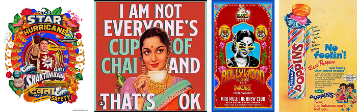

Kitsch embraces “bad taste” in an ironic, humorous way. It uses exaggerated or sentimental visuals from pop culture, often leaning into over-the-top patterns and saturated palettes.

- **Core elements:** Clashing prints, outdated fonts, shiny plastic textures, retro advertising visuals, excess.
- **Mood & occasion:** Campy, fun, ironic. Ideal for parody work, Gen Z fashion, or nostalgic remixes.
- **Type:** Loud display
- **Layout & motion:** Over-the-top, retro clip-art, deliberately gaudy
- **Starter tokens:** `--bg:#FFE3F1 --pink:#FF3DA5 --lime:#B6FF3D --cyan:#3DE0FF --ink:#2A1430`
- **Prompt scaffold:** "[your subject / scene], in the **Kitsch** style. clashing prints, outdated fonts, shiny plastic textures, retro advertising visuals, excess. Mood: campy, fun, ironic. ideal for parody work, gen z fashion, or nostalgic remixes. [add: composition, lighting, medium, aspect ratio]."

---

## 21. Y2K

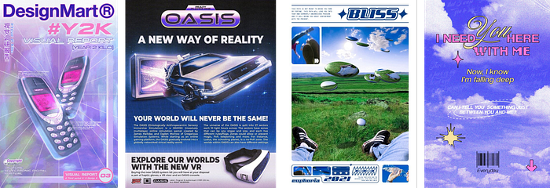

The Y2K aesthetic is inspired by late 1990s and early 2000s tech culture. It mixes cyber-futurism with millennial pop culture — think metallics, gradients, and digital gloss.

- **Core elements:** Chrome textures, pixel fonts, metallic finishes, iridescent gradients, matrix grids.
- **Mood & occasion:** Futuristic, nostalgic, edgy. Best for fashion branding, tech revival themes, or throwback interfaces.
- **Type:** Bubbly/techno font
- **Layout & motion:** Metallic chrome, gloss, stars, frosted blobs
- **Starter tokens:** `--bg:#DCEFFF --chrome:#C7D3DE --pink:#FF4FCB --blue:#4F8BFF --lime:#B9FF4F`
- **Prompt scaffold:** "[your subject / scene], in the **Y2K** style. chrome textures, pixel fonts, metallic finishes, iridescent gradients, matrix grids. Mood: futuristic, nostalgic, edgy. best for fashion branding, tech revival themes, or throwback interfaces. [add: composition, lighting, medium, aspect ratio]."

---

## 22. Bauhaus

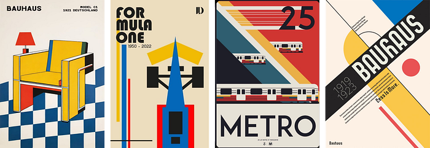

Bauhaus is functional, geometric, and minimal. Rooted in the German design school of the 1920s, it favors “form follows function” and uses basic shapes and primary colors. It’s the birth of modernist design.

- **Core elements:** Grid systems, sans-serif fonts, red-blue-yellow palette, circles/triangles/squares, minimal text.
- **Mood & occasion:** Rational, structured, modern. Great for architecture, product design, and clean brand systems.
- **Type:** Geometric sans (Futura-like)
- **Layout & motion:** Primary shapes, strict grid, function-first
- **Starter tokens:** `--bg:#F4F1EA --red:#E2483D --blue:#2D5BD0 --yellow:#F2C12E --ink:#1A1A1A`
- **Prompt scaffold:** "[your subject / scene], in the **Bauhaus** style. grid systems, sans-serif fonts, red-blue-yellow palette, circles/triangles/squares, minimal text. Mood: rational, structured, modern. great for architecture, product design, and clean brand systems. [add: composition, lighting, medium, aspect ratio]."

---

## 23. Brutalism

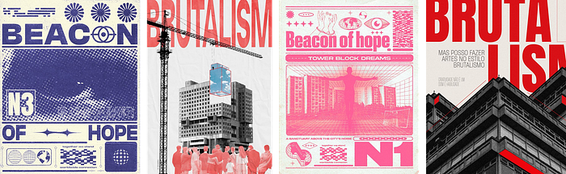

Brutalism in design is raw, bold, and purposefully unrefined. Borrowed from architecture, it rejects polish for stark functionality and visual honesty. In digital, it breaks UI norms to stand out.

- **Core elements:** Monospaced fonts, grayscale palettes, harsh edges, solid blocks, default buttons.
- **Mood & occasion:** Bold, disruptive, honest. Ideal for artist portfolios, experimental interfaces, or counterculture brands.
- **Type:** System/monospace, default
- **Layout & motion:** Stark borders, raw/unstyled, harsh, no decoration
- **Starter tokens:** `--bg:#FFFFFF --ink:#000000 --accent:#0000FF --alert:#FF0000`
- **Prompt scaffold:** "[your subject / scene], in the **Brutalism** style. monospaced fonts, grayscale palettes, harsh edges, solid blocks, default buttons. Mood: bold, disruptive, honest. ideal for artist portfolios, experimental interfaces, or counterculture brands. [add: composition, lighting, medium, aspect ratio]."

---

## 24. Cybercore

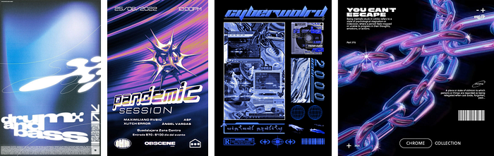

Cybercore is a high-tech, hyper-modern style drawing from hacker aesthetics, sci-fi, and the underground internet. It’s visually complex and packed with futuristic iconography.

- **Core elements:** Neon lights, glitch effects, code patterns, green/black themes, tech symbology.
- **Mood & occasion:** Futuristic, chaotic, dystopian. Great for tech events, hacking culture, or gaming visuals.
- **Type:** Mono/techno
- **Layout & motion:** Glitch, HUD overlays, neon-on-black, scanlines
- **Starter tokens:** `--bg:#07090F --cyan:#18E0FF --magenta:#FF2BD6 --lime:#B6FF1A`
- **Prompt scaffold:** "[your subject / scene], in the **Cybercore** style. neon lights, glitch effects, code patterns, green/black themes, tech symbology. Mood: futuristic, chaotic, dystopian. great for tech events, hacking culture, or gaming visuals. [add: composition, lighting, medium, aspect ratio]."

---

## 25. Synthwave

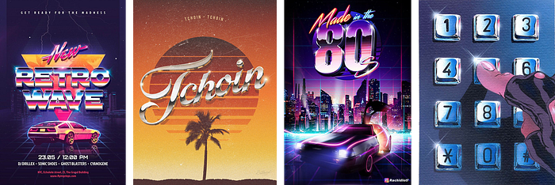

Synthwave is a retro-futuristic style inspired by 1980s sci-fi and synth music. It romanticizes a neon-lit future from a past era. Think “Tron” meets “Blade Runner” with a pink-purple glow.

- **Core elements:** Grid horizons, VHS textures, neon gradients, 3D chrome type, purple and cyan palettes.
- **Mood & occasion:** Retro-futuristic, vibrant, dreamy. Ideal for music visuals, arcade interfaces, or nostalgia apps.
- **Type:** Chrome/retro 80s font
- **Layout & motion:** Grid horizon, sunset gradient, VHS grain, glow
- **Starter tokens:** `--bg:#1A0B2E --magenta:#FF2E97 --cyan:#2DE2E6 --purple:#7B2FF7 --sun:#FFB347`
- **Prompt scaffold:** "[your subject / scene], in the **Synthwave** style. grid horizons, vhs textures, neon gradients, 3d chrome type, purple and cyan palettes. Mood: retro-futuristic, vibrant, dreamy. ideal for music visuals, arcade interfaces, or nostalgia apps. [add: composition, lighting, medium, aspect ratio]."

---

## 26. Vaporwave

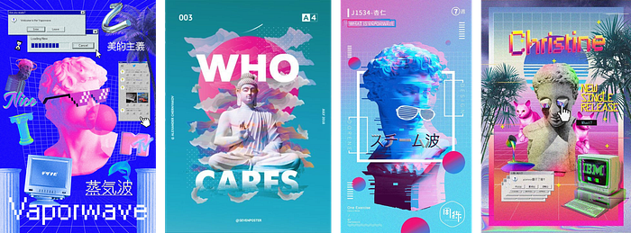

Vaporwave is a surreal, satirical style that critiques consumerism while celebrating 80s/90s nostalgia. It mixes classical statues with glitch art, Japanese characters, and retro software interfaces to create dreamlike visuals.

- **Core elements:** Pastel pinks and purples, VHS glitch, Greek busts, MS Paint elements, Japanese text, lo-fi textures.
- **Mood & occasion:** Ironic, dreamy, nostalgic. Ideal for indie music, visual art zines, or anti-establishment design.
- **Type:** Retro serif + Japanese type
- **Layout & motion:** Statues, glitch, pastel gradients, 90s net
- **Starter tokens:** `--bg:#1E1033 --pink:#FF6AD5 --cyan:#66FCF1 --lilac:#C792EA --mint:#A0F0D0`
- **Prompt scaffold:** "[your subject / scene], in the **Vaporwave** style. pastel pinks and purples, vhs glitch, greek busts, ms paint elements, japanese text, lo-fi textures. Mood: ironic, dreamy, nostalgic. ideal for indie music, visual art zines, or anti-establishment design. [add: composition, lighting, medium, aspect ratio]."

---

## 27. Pop Art

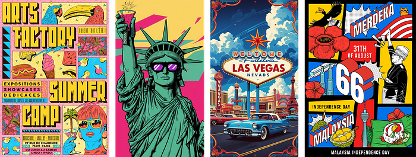

Pop Art draws inspiration from mass media, advertising, and comic books. It’s bold, colorful, and meant to grab attention. Originating in the 1950s-60s, it blurs the line between high art and popular culture.

- **Core elements:** Ben-Day dots, bold outlines, primary colors, comic sans or display fonts, speech bubbles.
- **Mood & occasion:** Loud, fun, energetic. Great for pop culture campaigns, retail packaging, or fashion visuals.
- **Type:** Bold comic slab/sans
- **Layout & motion:** Halftone dots, thick outlines, primary blocks
- **Starter tokens:** `--bg:#FFE600 --red:#E60023 --blue:#0057FF --ink:#111111`
- **Prompt scaffold:** "[your subject / scene], in the **Pop Art** style. ben-day dots, bold outlines, primary colors, comic sans or display fonts, speech bubbles. Mood: loud, fun, energetic. great for pop culture campaigns, retail packaging, or fashion visuals. [add: composition, lighting, medium, aspect ratio]."

---

## 28. Bento Box

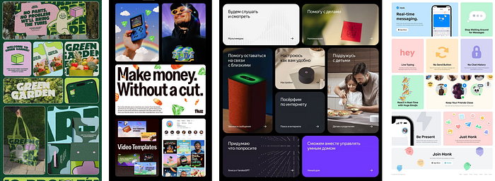

Bento UI is a trend in interface design that presents content in neatly organized, block-like sections — like compartments in a bento box. It makes complex layouts feel digestible and modern.

- **Core elements:** Rounded modular blocks, subtle shadows, icons with labels, micro-animations, neutral palettes.
- **Mood & occasion:** Organized, friendly, clean. Ideal for dashboards, portfolios, or productivity tools.
- **Type:** Clean neutral sans
- **Layout & motion:** Modular rounded grid cards, varied cell sizes
- **Starter tokens:** `--bg:#0F1115 --surface:#1A1D24 --accent:#6E8BFF --text:#E6E8EC`
- **Prompt scaffold:** "[your subject / scene], in the **Bento Box** style. rounded modular blocks, subtle shadows, icons with labels, micro-animations, neutral palettes. Mood: organized, friendly, clean. ideal for dashboards, portfolios, or productivity tools. [add: composition, lighting, medium, aspect ratio]."

---

## 29. Graffiti

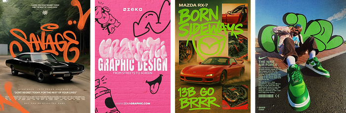

Graffiti design is rebellious, raw, and rooted in street culture. It’s loud and expressive, often using urban textures and hand-painted type. It conveys energy and social voice.

- **Core elements:** Spray paint textures, dripping letters, concrete backgrounds, neon colors, freestyle typography.
- **Mood & occasion:** Urban, defiant, expressive. Best for streetwear brands, music festivals, or youth-centric campaigns.
- **Type:** Graffiti/heavy display
- **Layout & motion:** Spray texture, drips, tags, layered street
- **Starter tokens:** `--bg:#16161A --orange:#FF5C00 --green:#00E0A4 --pink:#FF2E88 --ink:#FFFFFF`
- **Prompt scaffold:** "[your subject / scene], in the **Graffiti** style. spray paint textures, dripping letters, concrete backgrounds, neon colors, freestyle typography. Mood: urban, defiant, expressive. best for streetwear brands, music festivals, or youth-centric campaigns. [add: composition, lighting, medium, aspect ratio]."

---

## 30. Tenebrism

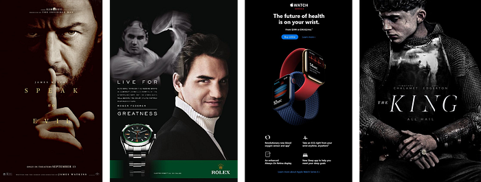

Tenebrism is a painting technique that uses dramatic lighting and intense contrasts between light and dark. In visual design, it creates depth, drama, and emotional weight.

- **Core elements:** High contrast chiaroscuro, black backgrounds, spotlighting, oil textures.
- **Mood & occasion:** Intense, emotional, moody. Ideal for gothic art, storytelling visuals, or cinematic posters.
- **Type:** Classical serif
- **Layout & motion:** Single dramatic light source, deep blacks, chiaroscuro
- **Starter tokens:** `--bg:#0A0807 --light:#E8D9B5 --accent:#8A5A2B --shadow:#000000`
- **Prompt scaffold:** "[your subject / scene], in the **Tenebrism** style. high contrast chiaroscuro, black backgrounds, spotlighting, oil textures. Mood: intense, emotional, moody. ideal for gothic art, storytelling visuals, or cinematic posters. [add: composition, lighting, medium, aspect ratio]."

---

## 31. Gothic

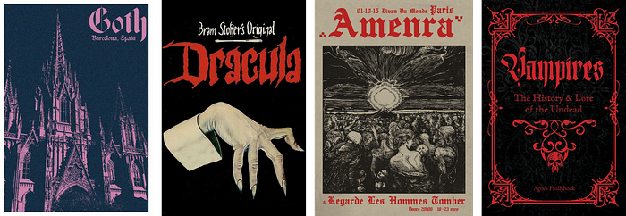

Gothic design is rooted in medieval architecture and dark romanticism. It’s characterized by pointed arches, dark color palettes, and ornate lettering. It evokes mystery and spiritual depth.

- **Core elements:** Blackletter fonts, stained glass textures, stone motifs, deep purples and blacks.
- **Mood & occasion:** Dark, dramatic, historic. Perfect for fantasy book covers, music posters, or alternative fashion.
- **Type:** Blackletter + serif
- **Layout & motion:** Pointed arches, ornament, dark and heavy
- **Starter tokens:** `--bg:#0C0B0E --stone:#3A3640 --blood:#6E1620 --silver:#C7CBD1`
- **Prompt scaffold:** "[your subject / scene], in the **Gothic** style. blackletter fonts, stained glass textures, stone motifs, deep purples and blacks. Mood: dark, dramatic, historic. perfect for fantasy book covers, music posters, or alternative fashion. [add: composition, lighting, medium, aspect ratio]."

---

## 32. Pointillism

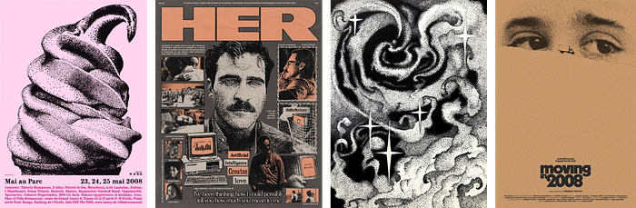

Pointillism is a painting technique using small dots of color to form an image. In design, it brings texture, detail, and a sense of movement or grain.

- **Core elements:** Dot clusters, optical mixing, pastel or impressionist palettes, fade transitions.
- **Mood & occasion:** Artistic, textured, tranquil. Great for fine art branding, creative editorials, or educational content.
- **Type:** Soft serif
- **Layout & motion:** Stippled dots, optical colour mixing, textured
- **Starter tokens:** `--bg:#F3EFE6 --dotA:#E0563B --dotB:#2D72B8 --dotC:#F2C14E --ink:#2A2A2A`
- **Prompt scaffold:** "[your subject / scene], in the **Pointillism** style. dot clusters, optical mixing, pastel or impressionist palettes, fade transitions. Mood: artistic, textured, tranquil. great for fine art branding, creative editorials, or educational content. [add: composition, lighting, medium, aspect ratio]."

---

## 33. Mixed Media

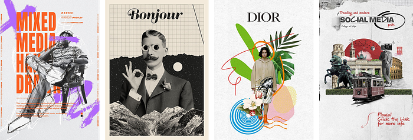

Mixed Media blends multiple visual styles and techniques — photography, illustration, textures — into one cohesive piece. It adds layers and depth, often evoking experimental or tactile storytelling.

- **Core elements:** Cutouts, overlays, analog + digital collage, hand-drawn + photo elements, paper textures.
- **Mood & occasion:** Eclectic, expressive, avant-garde. Ideal for magazines, experimental branding, or art education.
- **Type:** Mixed typefaces
- **Layout & motion:** Torn paper, collage, layered scanned textures
- **Starter tokens:** `--bg:#F2EDE3 --accent:#D7472F --tape:#E7C66B --ink:#232323`
- **Prompt scaffold:** "[your subject / scene], in the **Mixed Media** style. cutouts, overlays, analog + digital collage, hand-drawn + photo elements, paper textures. Mood: eclectic, expressive, avant-garde. ideal for magazines, experimental branding, or art education. [add: composition, lighting, medium, aspect ratio]."

---

## 34. Steampunk

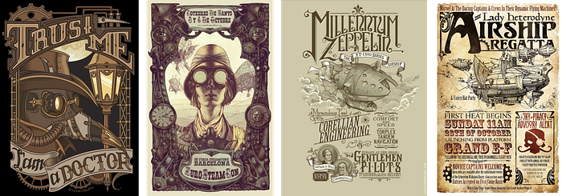

Steampunk fuses Victorian aesthetics with industrial-age machinery and sci-fi fantasy. It celebrates retro-futurism, with gears, brass, and corsets — all stylized in a mechanical world.

- **Core elements:** Copper tones, cogwheels, leather, top hats, serif type, steam and smoke motifs.
- **Mood & occasion:** Adventurous, vintage-futuristic, imaginative. Works well for games, books, or cosplay-related visuals.
- **Type:** Ornate serif + slab
- **Layout & motion:** Gears, cogs, brass fittings, Victorian-industrial
- **Starter tokens:** `--bg:#1F160E --brass:#B5852E --copper:#9C5A33 --cream:#E6D5B8`
- **Prompt scaffold:** "[your subject / scene], in the **Steampunk** style. copper tones, cogwheels, leather, top hats, serif type, steam and smoke motifs. Mood: adventurous, vintage-futuristic, imaginative. works well for games, books, or cosplay-related visuals. [add: composition, lighting, medium, aspect ratio]."

---

## 35. Kawaii

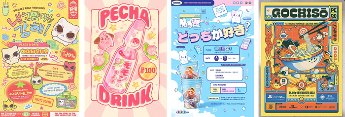

Kawaii is the Japanese culture of cuteness. It’s childlike, cheerful, and full of charm. Designs often feature adorable characters with simple features, soft colors, and positive vibes.

- **Core elements:** Pastel colors, rounded icons, baby faces, blushing cheeks, handwritten type.
- **Mood & occasion:** Sweet, innocent, joyful. Great for stationery, kids’ products, and whimsical branding.
- **Type:** Rounded soft font
- **Layout & motion:** Cute mascots, soft shapes, sparkles, bouncy
- **Starter tokens:** `--bg:#FFF0F6 --pink:#FF9EC4 --blue:#9ED8FF --yellow:#FFE59E --ink:#5A4A52`
- **Prompt scaffold:** "[your subject / scene], in the **Kawaii** style. pastel colors, rounded icons, baby faces, blushing cheeks, handwritten type. Mood: sweet, innocent, joyful. great for stationery, kids’ products, and whimsical branding. [add: composition, lighting, medium, aspect ratio]."

---

## 36. Coquette

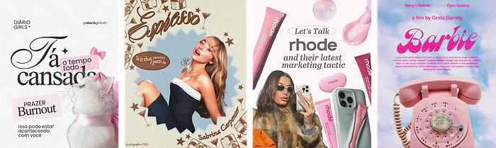

Coquette design is ultra-feminine and flirty with vintage undertones. It draws from early 2000s romantic aesthetics — think lace, bows, soft filters, and love letters.

- **Core elements:** Baby pinks, pearls, ribbon motifs, dainty serif fonts, heart shapes.
- **Mood & occasion:** Delicate, girly, nostalgic. Ideal for beauty brands, fashion reels, or romantic lifestyle blogs.
- **Type:** Script serif
- **Layout & motion:** Bows, ribbons, lace, soft feminine pink
- **Starter tokens:** `--bg:#FBEFF2 --rose:#E7A4B4 --cream:#FBF6F0 --gold:#C9A66B --ink:#5A4248`
- **Prompt scaffold:** "[your subject / scene], in the **Coquette** style. baby pinks, pearls, ribbon motifs, dainty serif fonts, heart shapes. Mood: delicate, girly, nostalgic. ideal for beauty brands, fashion reels, or romantic lifestyle blogs. [add: composition, lighting, medium, aspect ratio]."

---

## 37. Surrealism

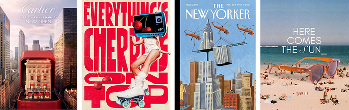

Surrealism breaks the boundaries of logic and realism. It thrives on dreamlike juxtapositions, abstract logic, and fantastical elements that challenge the viewer’s sense of reality.

- **Core elements:** Collage, disjointed objects, melting forms, metaphors, unexpected scale.
- **Mood & occasion:** Dreamy, unsettling, thought-provoking. Best for concept art, experimental visuals, or literary design.
- **Type:** Elegant serif
- **Layout & motion:** Impossible/dreamlike scenes, melting, floating
- **Starter tokens:** `--bg:#1A2438 --accent:#E8A33D --teal:#2E7D74 --cream:#EAD9B8`
- **Prompt scaffold:** "[your subject / scene], in the **Surrealism** style. collage, disjointed objects, melting forms, metaphors, unexpected scale. Mood: dreamy, unsettling, thought-provoking. best for concept art, experimental visuals, or literary design. [add: composition, lighting, medium, aspect ratio]."

---

## 38. Utilitarian

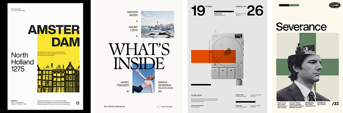

Utilitarian design is function-first, clean, and direct. It prioritizes clarity over aesthetics and often has a rugged, military-industrial feel.

- **Core elements:** Grid layout, monospaced or industrial fonts, muted tones, absence of decoration.
- **Mood & occasion:** Practical, minimal, efficient. Used in manuals, signage, utility apps, and technical interfaces.
- **Type:** Grotesk/stencil sans
- **Layout & motion:** Labels, stencils, function-first, no ornament
- **Starter tokens:** `--bg:#E8E6E1 --ink:#1B1B1B --accent:#E2552F(orange) --steel:#6E7378`
- **Prompt scaffold:** "[your subject / scene], in the **Utilitarian** style. grid layout, monospaced or industrial fonts, muted tones, absence of decoration. Mood: practical, minimal, efficient. used in manuals, signage, utility apps, and technical interfaces. [add: composition, lighting, medium, aspect ratio]."

---

## 39. Mid-Century

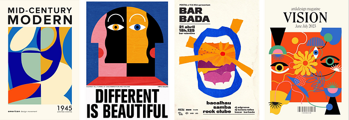

Mid-Century design is inspired by the 1940s–60s, emphasizing form, function, and organic simplicity. It blends bold geometry with warm textures and modern optimism.

- **Core elements:** Clean lines, retro colors, boomerangs, mod patterns, sans-serif fonts.
- **Mood & occasion:** Nostalgic, modernist, optimistic. Great for furniture branding, lifestyle blogs, or editorial layouts.
- **Type:** Geometric serif/sans
- **Layout & motion:** Atomic + organic shapes, 50s/60s optimism
- **Starter tokens:** `--bg:#EFE7D6 --mustard:#D6A035 --teal:#2E7D74 --orange:#C9552F --ink:#2A2622`
- **Prompt scaffold:** "[your subject / scene], in the **Mid-Century** style. clean lines, retro colors, boomerangs, mod patterns, sans-serif fonts. Mood: nostalgic, modernist, optimistic. great for furniture branding, lifestyle blogs, or editorial layouts. [add: composition, lighting, medium, aspect ratio]."

---

## 40. Scrapbook

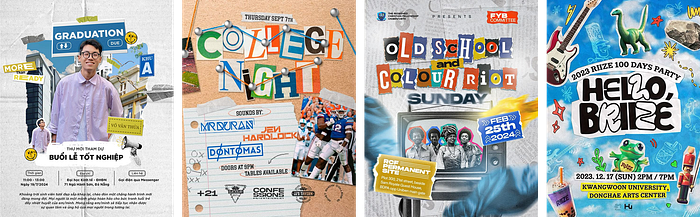

Scrapbook design mimics the handmade feel of collaging memories. It’s personal, layered, and nostalgic, using tape, torn edges, and handwritten notes.

- **Core elements:** Paper textures, washi tape, Polaroid frames, hand lettering, stickers.
- **Mood & occasion:** Sentimental, warm, nostalgic. Ideal for journaling apps, memory branding, or school projects.
- **Type:** Handwritten + casual
- **Layout & motion:** Stickers, washi tape, photo cut-outs, crafted
- **Starter tokens:** `--bg:#F6F0E4 --tape:#E8C879 --accent:#C76B53 --ink:#3A332B`
- **Prompt scaffold:** "[your subject / scene], in the **Scrapbook** style. paper textures, washi tape, polaroid frames, hand lettering, stickers. Mood: sentimental, warm, nostalgic. ideal for journaling apps, memory branding, or school projects. [add: composition, lighting, medium, aspect ratio]."

---

## 41. Neo Frutiger Aero

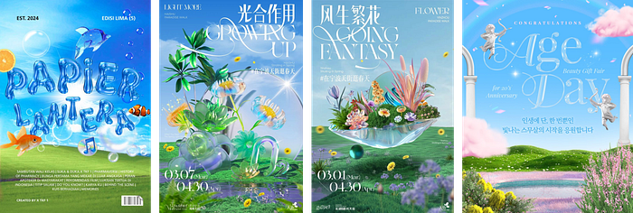

This is a Y2K revival sub-style mixing glossy UI elements, rounded sans-serifs like Frutiger, and bubble-like gradients. It’s clean, futuristic, and retro at once.

- **Core elements:** Aqua blues, semi-transparent bubbles, gloss overlays, friendly icons, rounded UI.
- **Mood & occasion:** Futuristic, nostalgic, clean. Perfect for tech, playful fintech, or Web3 brands.
- **Type:** Clean glossy sans
- **Layout & motion:** Glossy bubbles, water droplets, eco-tech optimism
- **Starter tokens:** `--bg:#DFF5E1 --glass:#BFE3FF --green:#58C46B --blue:#2FA3FF`
- **Prompt scaffold:** "[your subject / scene], in the **Neo Frutiger Aero** style. aqua blues, semi-transparent bubbles, gloss overlays, friendly icons, rounded ui. Mood: futuristic, nostalgic, clean. perfect for tech, playful fintech, or web3 brands. [add: composition, lighting, medium, aspect ratio]."

---

## 42. Dark Magic Academia

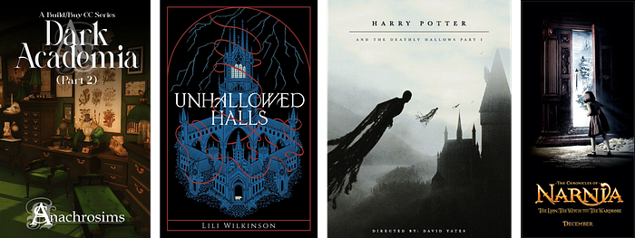

This style blends gothic academia with mysticism — like Harry Potter meets occult. It’s dark, intellectual, and full of symbolism.

- **Core elements:** Candles, spellbooks, antique etchings, black/gold palette, serif calligraphy.
- **Mood & occasion:** Mysterious, scholarly, magical. Great for fantasy games, book clubs, or witchy brands.
- **Type:** Classic serif
- **Layout & motion:** Candle-lit, old books, moody scholarly mystery
- **Starter tokens:** `--bg:#15110D --parchment:#D8C7A4 --green:#3B4A35 --gold:#A9863F --oxblood:#5A1F22`
- **Prompt scaffold:** "[your subject / scene], in the **Dark Magic Academia** style. candles, spellbooks, antique etchings, black/gold palette, serif calligraphy. Mood: mysterious, scholarly, magical. great for fantasy games, book clubs, or witchy brands. [add: composition, lighting, medium, aspect ratio]."

---

## 43. Light Academia

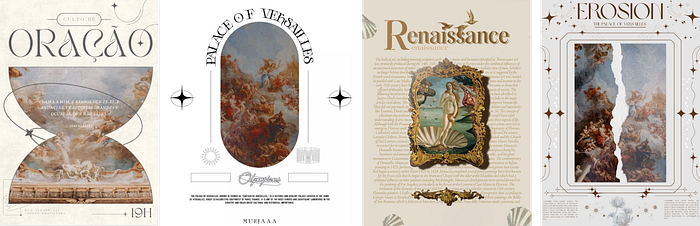

Light Academia is soft, poetic, and classical. It’s like walking through a European library in summer. It romanticizes knowledge, literature, and aesthetics.

- **Core elements:** Creamy neutrals, serif fonts, books, sunlight, linen textures.
- **Mood & occasion:** Scholarly, calm, refined. Works for journals, study apps, or aesthetic fashion.
- **Type:** Classic serif
- **Layout & motion:** Warm bookish, soft daylight, gentle scholarly
- **Starter tokens:** `--bg:#EFE8D8 --sepia:#B79B6E --ink:#3A332A --sage:#8A8C6E`
- **Prompt scaffold:** "[your subject / scene], in the **Light Academia** style. creamy neutrals, serif fonts, books, sunlight, linen textures. Mood: scholarly, calm, refined. works for journals, study apps, or aesthetic fashion. [add: composition, lighting, medium, aspect ratio]."

---

## 44. Wabi Sabi

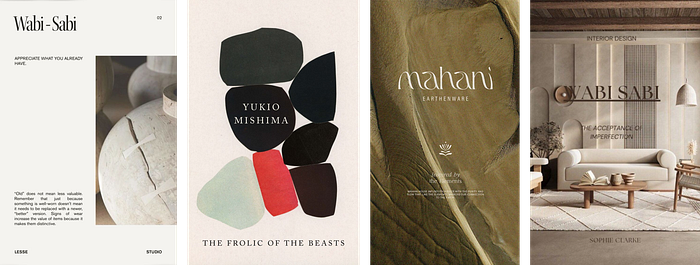

Wabi Sabi is a Japanese philosophy of embracing imperfection and impermanence. It values natural textures, asymmetry, and subtle beauty.

- **Core elements:** Earthy tones, rough pottery textures, natural light, organic forms, minimal sans-serif.
- **Mood & occasion:** Humble, calm, contemplative. Ideal for wellness brands, tea packaging, or mindful interfaces.
- **Type:** Light serif
- **Layout & motion:** Raw texture, imperfect, asymmetric, quiet restraint
- **Starter tokens:** `--bg:#EAE4D8 --clay:#B79B82 --charcoal:#3A352E --moss:#6E7256`
- **Prompt scaffold:** "[your subject / scene], in the **Wabi Sabi** style. earthy tones, rough pottery textures, natural light, organic forms, minimal sans-serif. Mood: humble, calm, contemplative. ideal for wellness brands, tea packaging, or mindful interfaces. [add: composition, lighting, medium, aspect ratio]."

---

## 45. South West / Wild West

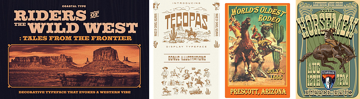

This style captures American desert landscapes, cowboy culture, and Native American influences. It’s warm, rugged, and rooted in heritage.

- **Core elements:** Terracotta, cacti, denim textures, cowboy boots, serif western fonts.
- **Mood & occasion:** Rugged, adventurous, nostalgic. Best for ranch brands, outdoor gear, or festival posters.
- **Type:** Slab serif
- **Layout & motion:** Aztec/Navajo motifs, leather, desert frontier
- **Starter tokens:** `--bg:#E7D4B5 --rust:#B5552E --turquoise:#2E8B8B --cactus:#6E8B4E --ink:#3A2A1F`
- **Prompt scaffold:** "[your subject / scene], in the **South West / Wild West** style. terracotta, cacti, denim textures, cowboy boots, serif western fonts. Mood: rugged, adventurous, nostalgic. best for ranch brands, outdoor gear, or festival posters. [add: composition, lighting, medium, aspect ratio]."

---

## 46. Nautical

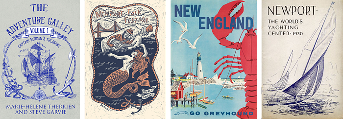

Nautical design is inspired by sea life, ships, and coastal living. It’s fresh and orderly, with classic maritime elements and a palette drawn from ocean and sand.

- **Core elements:** Navy and white, anchors, ropes, stripes, brass, serif or stencil fonts.
- **Mood & occasion:** Fresh, structured, maritime. Perfect for seafood brands, beach resorts, or summer campaigns.
- **Type:** Slab/serif
- **Layout & motion:** Stripes, anchors, knots, maritime crispness
- **Starter tokens:** `--bg:#F2EFE6 --navy:#1E3A5F --red:#C0392B --rope:#C8A86B --white:#FFFFFF`
- **Prompt scaffold:** "[your subject / scene], in the **Nautical** style. navy and white, anchors, ropes, stripes, brass, serif or stencil fonts. Mood: fresh, structured, maritime. perfect for seafood brands, beach resorts, or summer campaigns. [add: composition, lighting, medium, aspect ratio]."

---

## 47. Rebus

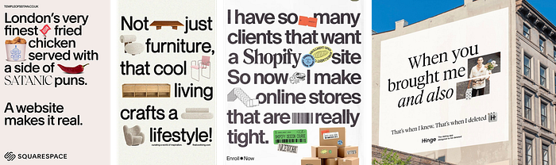

Rebus design communicates through symbols or images representing sounds or words. It’s clever and interactive, often used for puzzles or branding.

- **Core elements:** Pictograms, visual puns, image-type hybrids, clean layouts.
- **Mood & occasion:** Witty, playful, intellectual. Works great for educational design, puzzles, or brand storytelling.
- **Type:** Bold clear sans
- **Layout & motion:** Icons replace words, playful picture-puzzle
- **Starter tokens:** `--bg:#FFF8E7 --accent:#E2552F --blue:#2D72B8 --ink:#1F1B16`
- **Prompt scaffold:** "[your subject / scene], in the **Rebus** style. pictograms, visual puns, image-type hybrids, clean layouts. Mood: witty, playful, intellectual. works great for educational design, puzzles, or brand storytelling. [add: composition, lighting, medium, aspect ratio]."

---

## 48. Glassmorphism

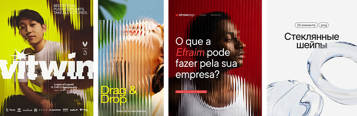

Glassmorphism gives UI elements a frosted glass look — transparent with blur and depth. It’s soft, futuristic, and layered.

- **Core elements:** Frosted backgrounds, blur effects, semi-transparency, soft shadows, neon tints.
- **Mood & occasion:** Futuristic, elegant, sleek. Common in apps, OS UI, or product landing pages.
- **Type:** Clean sans
- **Layout & motion:** Frosted blur, transparency, layered depth, light borders
- **Starter tokens:** `--bg:linear(#1B2A4A,#3B2F5E) --glass:rgba(255,255,255,.1) --accent:#6E8BFF --text:#EAF0FF`
- **Prompt scaffold:** "[your subject / scene], in the **Glassmorphism** style. frosted backgrounds, blur effects, semi-transparency, soft shadows, neon tints. Mood: futuristic, elegant, sleek. common in apps, os ui, or product landing pages. [add: composition, lighting, medium, aspect ratio]."

---

## 49. Modular Typography

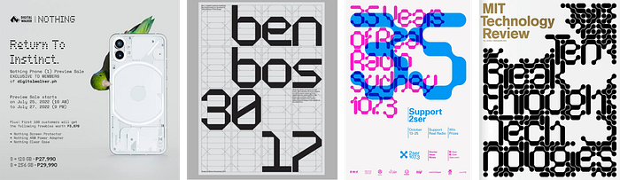

This style breaks type into grids or building blocks. It allows flexible systems and unique visual rhythm, often experimental in nature.

- **Core elements:** Geometric letterforms, typographic grids, uniform spacing, variable layouts.
- **Mood & occasion:** Structural, modern, playful. Works for posters, branding systems, and experimental typography.
- **Type:** Grotesk
- **Layout & motion:** Type as a grid system, baseline rhythm, systematic
- **Starter tokens:** `--bg:#F4F2EC --ink:#141414 --accent:#E2483D`
- **Prompt scaffold:** "[your subject / scene], in the **Modular Typography** style. geometric letterforms, typographic grids, uniform spacing, variable layouts. Mood: structural, modern, playful. works for posters, branding systems, and experimental typography. [add: composition, lighting, medium, aspect ratio]."

---

## 50. Neo-Brutalism

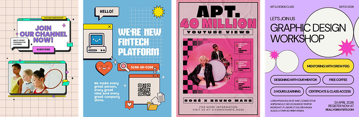

A cleaner, more structured evolution of classic Brutalism. It retains raw honesty but adds better UI practices — useful in digital products that want to be bold yet functional.

- **Core elements:** Bold colors, large type, stark layouts, minimal UI components, purposeful asymmetry.
- **Mood & occasion:** Confident, bold, raw-yet-usable. Ideal for design portfolios, creative agency sites, or digital magazines.
- **Type:** Bold heavy sans
- **Layout & motion:** Thick black borders, hard offset shadows, flat blocks
- **Starter tokens:** `--bg:#FFFDF5 --ink:#111111 --yellow:#FFD23F --pink:#FF5C8A --blue:#2D5BFF`
- **Prompt scaffold:** "[your subject / scene], in the **Neo-Brutalism** style. bold colors, large type, stark layouts, minimal ui components, purposeful asymmetry. Mood: confident, bold, raw-yet-usable. ideal for design portfolios, creative agency sites, or digital magazines. [add: composition, lighting, medium, aspect ratio]."

---
